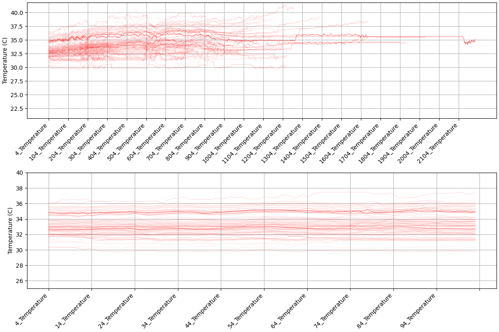
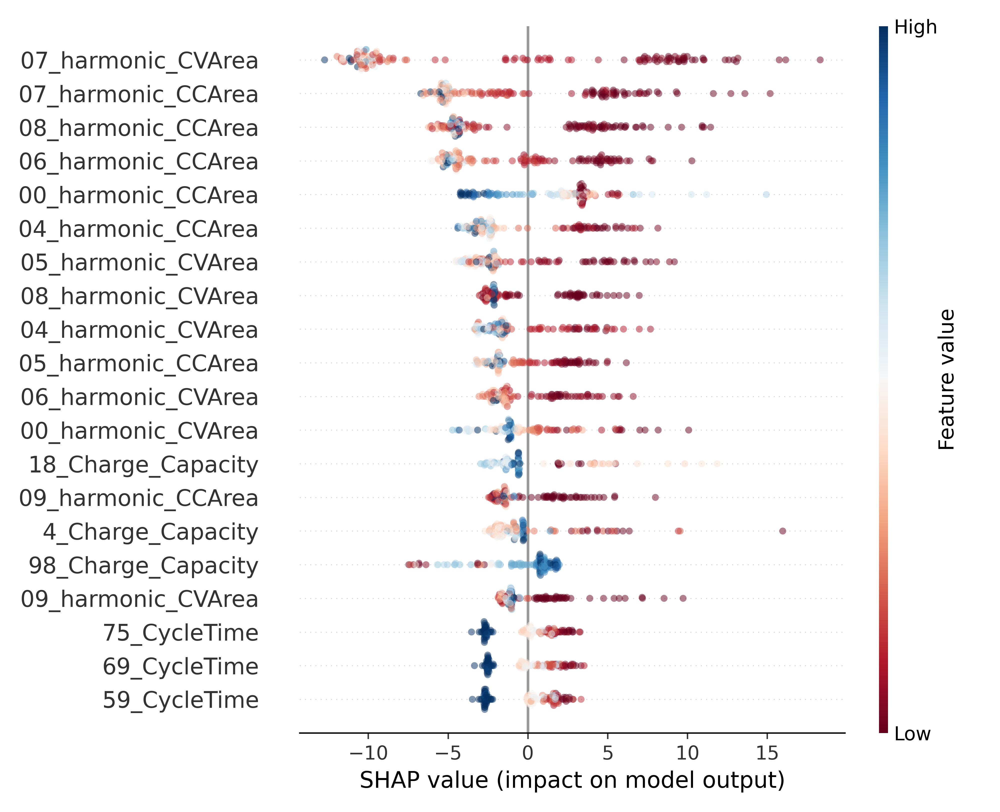

# Battery Lifetime Predictions from Initial Cycling Data

## Goal
To build a predictive model to use the initial 100 cycles to estimate how many cycles it would take for a battery’s state of health [(SOH)](https://en.wikipedia.org/wiki/State_of_health) to drop to 90%.

## Executive Summary
1. We built a predictive Random Forest Model (RFM) to estimate the number of cycles required for a battery’s SOH to drop to 90%, based on the first 100 cycles of data.
2. Our model has a median absolute percentage error (MdAPE) of 8.02% and a coefficient of determination (R²) of 0.653.

#### Model Performance Summary
| Model | Description | Holdout R² | Holdout MdAPE | Holdout RMSE |
| --- | --- | --- | --- | --- |
| GBM | 4 sets of cyclic features (No PSD features) | 0.478 | 16.6% | 234.1 |
| GBM | 4 sets of cyclic features + PSD features | 0.684 | 12.22% | 182.07 |
| RFM | 4 sets of cyclic features (No PSD features) | 0.598 | 8.86% | 205.5 |
| RFM | 4 sets of cyclic features + PSD features | 0.653 | <u>**8.02%**</u> | 190.9 |

Table 1: Summary of performances of the four models.  

# Introduction

## Data
The data was obtained from the following source: 
[link](https://data.matr.io/1/projects/5c48dd2bc625d700019f3204).  The experiment was summarized in [Severson et al.](https://www.nature.com/articles/s41560-019-0356-8) and in [Attila et al.](https://www.nature.com/articles/s41586-020-1994-5)  We initially used the following features for each cycle from 2 to 102:

1. Charge Capacity (in mAh).
2. Mean Temperature (T).
3. Maximum Internal Resistance.
4. Cycle Duration (Time).

Per the authors, the batteries were sourced from the [A123Systems](./images/battery_spec_sheet.pdf). Each battery received a different charging protocol (waveform). We featurized this by converting the charge/discharge current (CC) or voltage (CV) to their respective Power Spectral Density (PSD). 

## Models
Due to the small size of our dataset (132 batteries total), using deep learning or neural network models was not practical. Instead, we focused on two decision-tree-based models: **Random Forest Model (RFM)** and **Gradient Boosting Model (GBM)**. Although GBM is generally considered superior, RFM yielded better results in our case.

## Shapley Analysis
Shapley analysis revealed that the most impactful features were the PSD areas of the higher harmonics, confirming the hypothesis that the charging protocol significantly influences battery SOH.

# Background

### Data Source and Bias Considerations
The dataset originates from Severson et al., "Data-driven prediction of battery cycle life before capacity degradation," *Nature Energy*, Volume 4, pages 383–391 (2019). The study employed a Bayesian Reinforcement Learning (BRL) method to optimize the charging protocol.

- The dataset may contain bias due to how the BRL method explores the independent variable space.
- Despite this, it includes sufficient variation to be useful for training predictive models.

Typical charging/discharging protocols are shown below. Some protocols exhibit a periodicity of 60 minutes, while others are closer to 50 minutes.

Each battery underwent approximately 90–1500 cycles of testing, with experiments often terminating soon after SOH dropped below 90%. Measurement intervals varied, as shown in the histogram below.

### Internal Resistance
Longer-lifetime batteries exhibit lower internal resistance. Below is the internal resistance evolution over the testing period.

### Temperature
Temperature variations were small, though minor fluctuations occurred during the first 100 cycles.

### Cycle Time
There were two main cycle durations (~48 and ~55 minutes). Batteries with shorter cycles tended to have longer lifetimes.

### Charge Capacity
Batteries with longer lifetimes exhibited a smaller initial surge in charge capacity during the first 100 cycles.

### Power Spectral Density (PSD) of the charge/discharge current and voltage
The most important features derived from this were:
1. Frequency of the first harmonic (fundamental).
2. Peak areas of the first 10 harmonics.

### Metrics
We listed three metrics in Table 1 for each model.  We believe MdAPE is the most appropriate metric because it targets a criterion that is more realistic to one in our likely use case, which is tha actually lifetime of the battery (R² does not).  It is also less sensitive to outliers than RMSE.

## Modeling
We implemented the RFM model using the scikit-learn library and the GBM model using XGBoost. In general:

- The Random Forest Model builds deep trees that can overfit, but decorrelating multiple trees helps mitigate this.
- The Gradient Boosting Model builds shallow trees sequentially, reducing residual errors but increasing computational time.
- Despite GBM's reputation for superior performance, **RFM** performed better in our case due to the small dataset.

<figure>
    
    
    <figcaption>Figure 8: Scatter plot of the predicted vs holdout data of the GBM (L) and RFM (R) model</figcaption>
</figure>

## Shapley Values: Feature Importance
Shapley values assess the contribution of each feature to the model’s predictions. They provide local, consistent explanations of model behavior. We computed Shapley values using the Python SHAP library.

The top 20 most predictive features are shown below.

<figure>
    
    <figcaption>Figure 9: Shapley values for the top 20 features</figcaption>
</figure>

Other SHAP plots can be found in this [folder](./images/shapley/).

## Summary and Conclusions
1. Our *best model* has a MdAPE of **8.02%** and a coefficient of determination (R²) of **0.653**.
2. **Including PSD features of the charge/discharge waveform significantly improved model performance.** This aligns with the hypothesis that charging protocols impact battery SOH.
3. **The RFM model outperformed GBM in this dataset.** This was especially evident at extreme values of the predicted variable.
4. **We prioritized MdAPE over RMSE due to the limited dataset size.** The best-performing model was RFM with PSD features.

